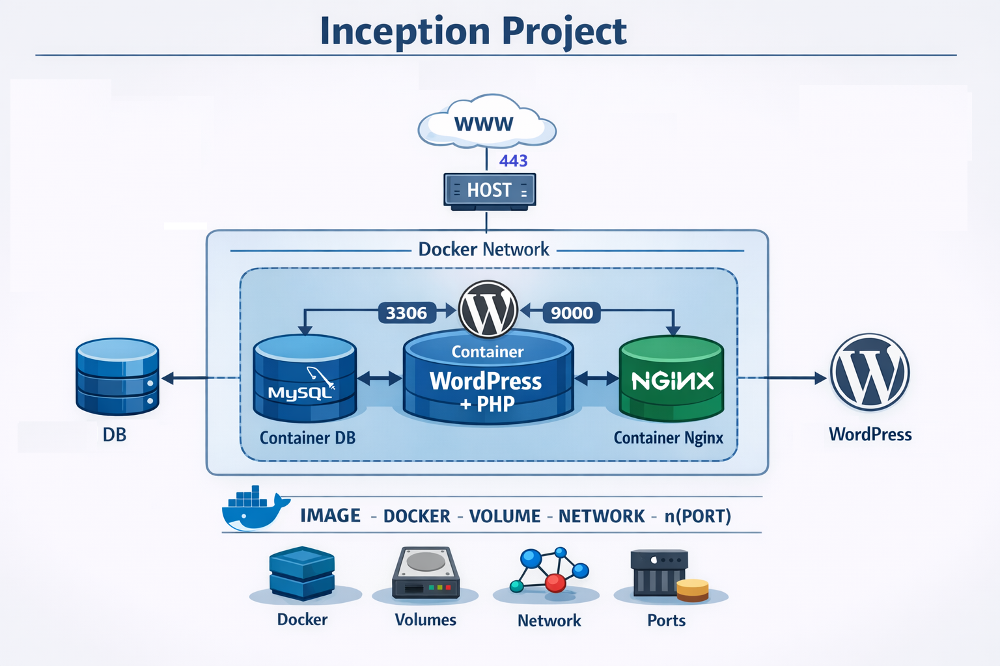

# 🏗️ Inception - 42 School Project

## 📘 Project Overview
**Inception** is a system administration and virtualization project from **42 School**.  
The goal is to learn how to use **Docker** to build and configure a lightweight, secure, and reproducible server infrastructure.  
You must use **Docker Compose** to set up multiple isolated containers running different services on a virtual machine.
<p align="center">  🌍 Architecture of infrastructure</p>
<p align="center"></p>
---

## 🎯 Objectives
> Build a small infrastructure composed of multiple containers, without using any pre-built images like `nginx:latest`. The debian-bookworm os was used.

### Requirements:
- Use **Docker Compose** for orchestration.  
- Each service must run in its **own container**.  
- Use **Volumes** to persist data.  
- **All images must be built from your own Dockerfiles**.  
- The project must run inside a **virtual machine (VM)**, preferably **Debian**.
- You need to put your own static site (index.html) page in your folder **/home/*login*/data/website/**.

---

## 🧩 Services Overview

| Service | Description |
|----------|-------------|
| **Nginx** | HTTPS reverse proxy and TLS certificate setup |
| **WordPress (php-fpm)** | The main website service |
| **MariaDB** | Database for WordPress |
| **FTP** *(bonus)* | File transfer service |
| **Adminer / Portainer** *(bonus)* | Management panel |
| **cAdvisor** *(bonus)* | Real-time container monitoring tool available on port **8080** |
| **Static website / Monitoring tools** *(bonus)* | Additional services (located under `requirements/bonus/website`) |

---
## 🏗️ Architecture
- Only **NGINX** is exposed to the outside
- **WordPress** communicates with **MariaDB**
- **Volumes** ensure data persistence
- All containers communicate through the **Docker network `inception`**

---
## 🏗️ Project Structure
```bash
inception/
├── Makefile
├── secrets/ # Sensitive files (at project root, ignored by git)
├── srcs/
│   ├── docker-compose.yml
│   ├── .env # Environment variables (ignored by git)
│   └── requirements/
│       ├── mariadb/
│       │   ├── Dockerfile
│       │   └── conf/
│       │       ├── 50-server.cnf
│       │       └── entrypoint.sh
│       ├── nginx/
│       │   ├── Dockerfile
│       │   └── conf/
│       │       └── default.conf
│       ├── wordpress/
│       │   ├── Dockerfile
│       │   └── conf/
│       │       └── entrypoint.sh
│       └── bonus/
│           ├── adminer/
│           │   └── Dockerfile
│           ├── cadvisor/
│           │   └── Dockerfile
│           ├── ftp/
│           │   ├── Dockerfile
│           │   └── conf/
│           │       └── entrypoint.sh
│           └── website/
│               └── Dockerfile
└── README.md
```
---
## ⚙️How to Run the Project
**Install Docker, Docker Compose and Make**
```bash
sudo apt-get update
sudo apt-get install docker.io docker-compose make -y
sudo systemctl enable docker
sudo systemctl start docker
sudo usermod -aG docker $USER
```
Reboot the VM after this step.

**Create Required Directories**
```bash
mkdir -p /home/layang/secrets
```
**Create Secrets Files ⚠️**
You must create the password files used in docker-compose.yml, Example:
```bash
echo "mypassword" > /home/layang/secrets/db_root_password.txt
echo "mypassword" > /home/layang/secrets/db_password.txt
echo "mypassword" > /home/layang/secrets/credentials.txt
```
These secrets will be mounted inside containers at: /run/secrets/

---
## ⚙️Create Environment File
Create: srcs/.env

**With the following content:**
```bash
DOMAIN_NAME=layang.42.fr
DATA_PATH=/home/layang/data

# ----------------------------
# WordPress Database
# ----------------------------
DB_HOST=mariadb:3306
DB_NAME=wordpress_mariadb
DB_USER=wp_db_user
DB_PASSWORD=
DB_ROOT_PASSWORD=

# ----------------------------
# WordPress Admin
# ----------------------------
WORDPRESS_ADMIN_USER=layang42
WORDPRESS_ADMIN_PASSWORD=
WORDPRESS_ADMIN_EMAIL=youremail

# ----------------------------
# WordPress secondary user
# ----------------------------
WP_SECONDARY_USER=layang43
WP_SECONDARY_PASSWORD=
WP_SECONDARY_EMAIL=youremail2

# ----------------------------
# Redis
# ----------------------------
REDIS_PASSWORD=yourpassword

# ----------------------------
# ftp
# ----------------------------
FTP_USER=layang42
FTP_PASS=yourpassword
PASV_ADDRESS=layang.42.fr
```
---
## ⚙️Build and Start Containers
From the project root:
```bash
make
```
---
## 🧪 Useful Make Commands
| Command       | Description                |
| ------------- | -------------------------- |
| `make`        | Setup + Build + Start      |
| `make build`  | Build images               |
| `make up`     | Start containers           |
| `make down`   | Stop and remove containers |
| `make logs`   | Show logs                  |
| `make clean`  | Remove data                |
| `make fclean` | Full Docker cleanup        |
| `make prune`  | Remove unused Docker data  |
---
## 🌐 Access Services
| Service   | URL                                                        |
| --------- | ---------------------------------------------------------- |
| WordPress | [https://layang.42.fr](https://layang.42.fr)               |
| Adminer   | [http://layang.42.fr/adminer](http://layang.42.fr/adminer) |
| cAdvisor  | [http://layang.42.fr:8080](http://layang.42.fr:8080)       |
| FTP       | ftp://layang.42.fr                                         |
---
## 💾 Volumes
| Volume    | Path                       |
| --------- | -------------------------- |
| mariadb   | /home/login/data/mariadb   |
| wordpress | /home/login/data/wordpress |
| website   | /home/login/data/website   |
---
## 🔐 Secrets
| Secret                | File                 |
| --------------------- | -------------------- |
| db_root_pw            | db_root_password.txt |
| db_pw                 | db_password.txt      |
| credentials_pw        | credentials.txt      |
| credentials_second_pw | credentials.txt      |

---
## 🧠 What I Learned
- Docker and Docker Compose
- Container networking (bridge network)
- Reverse proxy with Nginx
- HTTPS / TLS configuration
- MariaDB database setup
- WordPress with PHP-FPM
- Docker volumes and bind mounts
- Docker secrets management
- FTP server inside Docker
- Container monitoring with cAdvisor
- System administration on Debian


